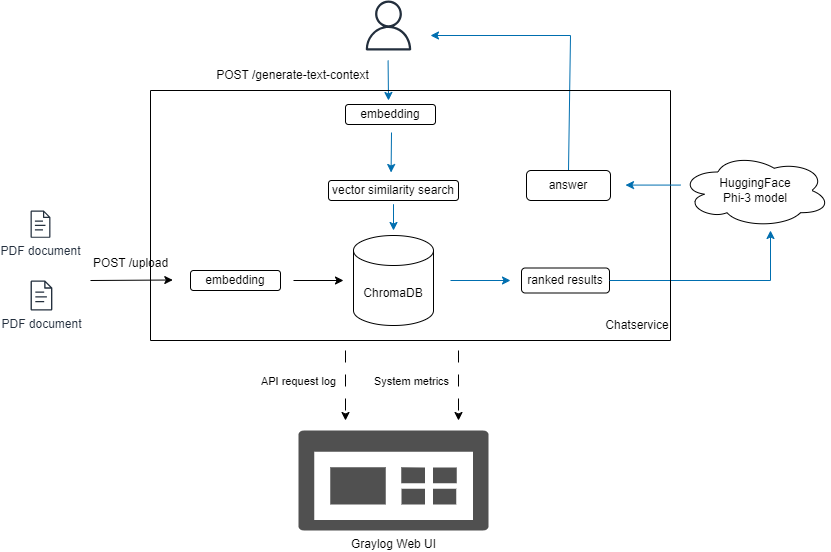
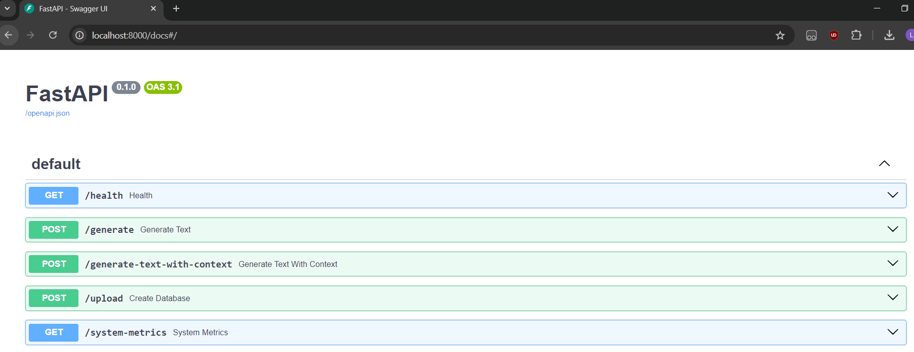
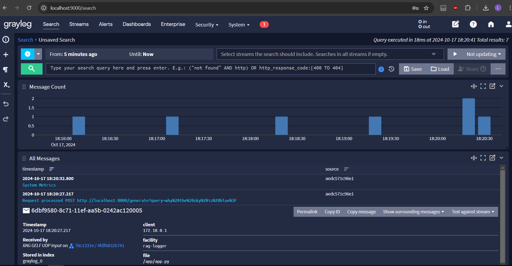
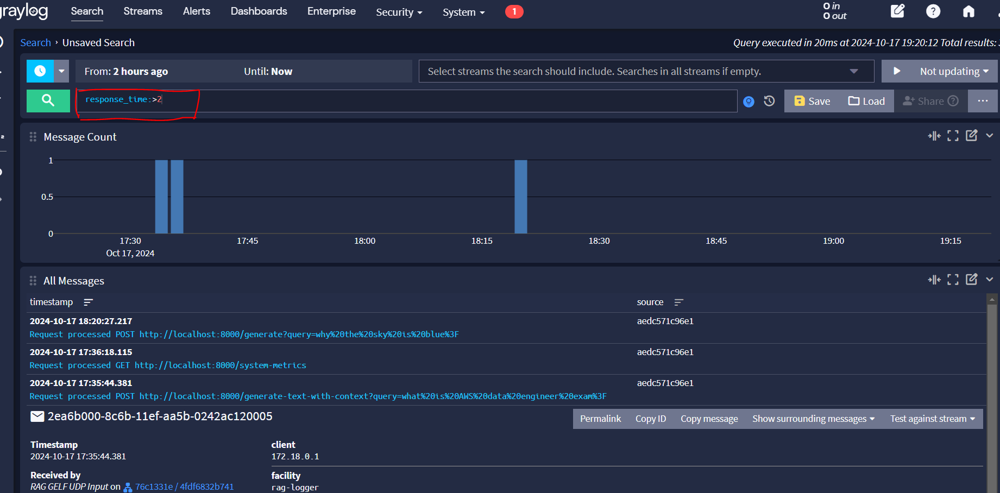
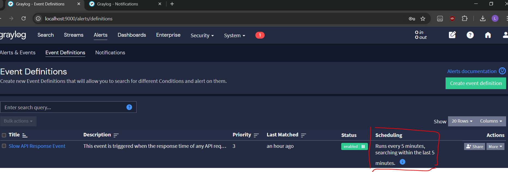
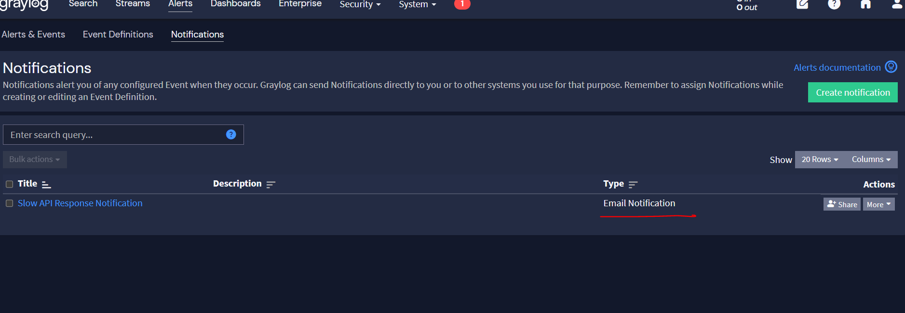
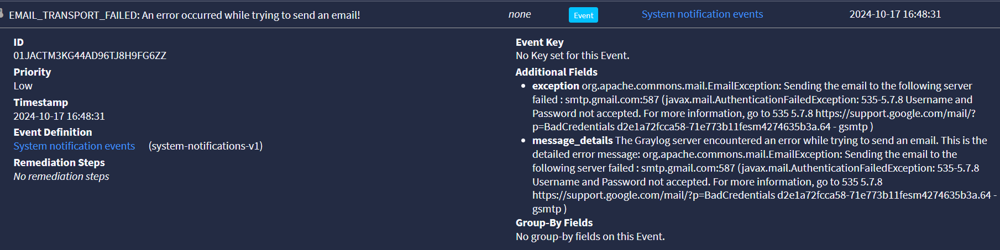

# RAG-Pipeline-With-FastAPI-and-Graylog

A FastAPI-based service implementing a Retrieval-Augmented Generation (RAG) pipeline for text generation, integrated with Graylog for API monitoring. The service allows users to upload files, store them in a Chroma vector store, and generate context-aware text using a pre-trained model endpoint ([microsoft/Phi-3-mini-4k-instruct](https://huggingface.co/microsoft/Phi-3-mini-4k-instruct)) from HuggingFace.

## Architecture

The pipeline consists of two services where need to bring up using `docker compose`:
- `chastservice`: service to serve API endpoints
- `graylog`: service to monitor API performance and server metrics


### API Endpoints

```
POST /generate

Request:
- query: the question or prompt for text generation.

Response:
Generated text based on the query (without context awareness).
```
<br />

```
POST /generate-text-with-context

Request:
- query: the question or prompt for text generation.

Response:
A context-aware answer based on the uploaded documents stored in the vector database.
```
<br />


```
POST /upload

Request:
- files: list of PDF files to be uploaded, processed and stored in vector store.

Response:
Number of files uploaded and stored successfully.
```
<br />

```
GET /system-metrics

Response:
Returns CPU, memory, and disk usage metrics and logs to graylog service.
```
<br />

```
GET /health

Response:
Returns the health status of the service.
```



The pipeline follows these steps to provide responses to your questions and send logs and system health details to Graylog service:

1. User upload PDF files via `/upload` to populate the ChromaDB store.

2. Using [BAAI/bge-small-en-v1.5](https://huggingface.co/BAAI/bge-small-en-v1.5) as embedding model, those files content are extracted and divided into smaller text embeddings which are later saved to ChromaDB.

3. User ask question by submiting query request to API `/generate-text-with-context`.

4. The pipeline communicates with Microsoft model [microsoft/Phi-3-mini-4k-instruct](https://huggingface.co/microsoft/Phi-3-mini-4k-instruct) to process user queries and generated the suitable responses based on the provided relevant context from the ChromaDB.

5. Any API request would be logged and sent to Graylog service and this is handled by FastAPI middleware, namely `async def log_request()`.

6. System metrics of the server are sent to Graylog every 1 minute and is done at docker `HEALTHCHECK` command at `chatservice/Dockerfile`.


## Setup

1. Clone the repo:
```
git clone https://github.com/IvanLauLinTiong/rag-fastapi-graylog-monitoring
cd rag-fastapi-graylog-monitoring

```

2. Rename the `.env.example` to `.env` and set your `HUGGINGFACEHUB_API_TOKEN` (see [tutorial here](https://huggingface.co/docs/hub/en/security-tokens) to get your token).

3. Install docker on your system and run command below:
```
docker compose up -d
```
***This would take a moment (5 - 10 min) to spin up the containers as the docker images need to be built on first run. It would be faster to bring up in next new runs.***

4. After all containers are running up, you may acccess the UIs below:
- API doc UI: http://localhost:8000/docs

- graylog web UI: http://localhost:9000/search


5. Inside graylog UI, you could:
-  input any keyword at the search box, for example `response_time:>2` to view any logs has API
response time that greater than 2 seconds:



- configure the alert notification for Slow API response event. Currently the event condition is searching within the last 5 minutes of log messages and run every 5 minutes and the notification is sent via email:

<br />
<br />



## Caveats
1. The pipeline would be slow to bring up on first run since all dependecies and images are need to be downloaded and built before running.

2. The email alert notification on slow API response time is not sent successfully.


3. The pipeline is not scalable to support more than one user access.


## MLOps principles Reflection
Currently only two princples of MLOps are applied throughout the entire development:

1. Version Control for Code and Models

In MLOps, it’s important to maintain version control of both the code and the machine learning models. I am using pre-trained model (microsoft/Phi-3-mini-4k-instruct) from HuggingFace transformers, which ensures consistency by leveraging a specific version of the model. I could extend this setup by using tool like DVC (Data version control) to version control the data (retrieved documents) or Mlflow for the model if I want to fine tune or swap the model.

2. Monitoring and Logging

Graylog provides system-level monitoring, which aligns with the MLOps principle of continuously monitoring the ML infra. I monitor API performance (response times, error rates, etc.) and system resources (CPU, memory, etc.)
Email alert notification is also configured when the API response time exceeds a certain threshold (here 2 seconds). This ensures that the system remains responsive and reliable, helping to meet SLAs (Service Level Agreements), which is crucial in production-grade ML systems.

## Future Improvements
1. Address those caveats that higligted in Caveats section:
- docker optimization like using multi-stage build
- troubleshoot firewall on Graylog server whether open for email SMTP protocol
- add message queue to pipeline and configure ChromaDB to support multi-user access

2. Add CI/CD pipeline which performs unit testing for APIs , evaluting pre-trained model output and auto deploy the FastAPI docker image.

3. Add horizontal scalability and resilience to the container services like deploy them on kubernetes platform.